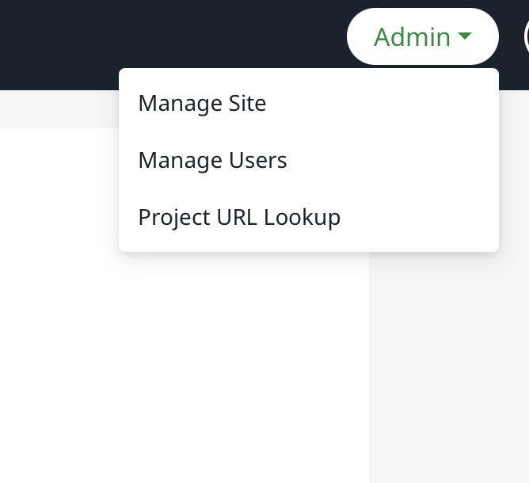

## Step 1 安装docker

首先安装docker需要sudo权限

之前在服务器上有一个snap版本的docker，这个不太行，需要先删除之后重新安装

一开始上来以为服务器上有docker，于是准备加一个docker组

```
# 1. 加入 docker 组
sudo usermod -aG docker $USER

# 2. 重新登录 docker
newgrp docker

# 3. 验证
docker ps
docker compose ps
```

但是发现

```
usermod: group 'docker' does not exist

Failed to restart docker.service: Unit docker.service not found.
```

之后检查docker

```
which docker || echo "no docker cli"
docker --version 2>/dev/null || true
ps -p 1 -o comm=

```

返回

```
/snap/bin/docker
Docker version 28.4.0, build d8eb465
systemd
```

说明目前的docker是snap版本的

然后先把这个删了，再重新安装官方版本的docker

```
sudo snap remove docker ##删除
curl -fsSL https://get.docker.com | sudo sh ## 安装
sudo usermod -aG docker <username> ## 把自己加到有权限的组里

newgrp docker ## 登录

## 检查环境
docker ps
docker compose version
```

当中发现有些乱七八糟的进程

```
curl -fsSL https://get.docker.com | sudo sh

## 首先是在安装的 时候发现有apt-get的进程在阻挡

# Executing docker install script, commit: 8b33a64d28ec86a1121623f1d349801b48f2837b
+ sh -c 'apt-get -qq update >/dev/null'
E: Could not get lock /var/lib/apt/lists/lock. It is held by process 2199564 (apt-get)
E: Unable to lock directory /var/lib/apt/lists/

## 并且这个进程一直不动，想办法杀掉也不太行，最后是重启服务器解决了- -
```

最后重启之后报错

```
curl -fsSL https://get.docker.com | sudo sh
curl: (35) OpenSSL SSL_connect: Connection reset by peer in connection to get.docker.com:443
```

之后还是通过apt以及官方源安装成功

```
sudo apt update
sudo apt install -y docker.io docker-compose-plugin
sudo systemctl enable --now docker

## 通过以下命令验证安装成功
docker --version
docker compose version
sudo docker ps

## 成功之后给自己加个权限
sudo systemctl enable --now docker
systemctl status docker
sudo groupadd -f docker
sudo usermod -aG docker <username>
newgrp docker
```

之后就可以用没有sudo权限的这个账户去在docker里安装Overleaf

## Step 2 克隆Overleaf-toolkit的GitHub仓库

Overleaf的仓库提供了一个比较简单的toolkit，但是国内可能会有各种网络问题

由于学校的网络对一些网站的访问有很大问题，尝试了半天换各种镜像什么的，一直不行，最后直接在自己的电脑上直接去GitHub（https://github.com/overleaf/toolkit）上下了一个，传到服务器上（然后才是噩梦的开始🐶）

然后把这个文件重命名为overleaf-toolkit，再给他unzip掉，或者先unzip再重命名文件夹也可以

## Step 3 在docker中安装一个Overleaf

之后根据官方文档开始尝试安装

首先cd进目录

```
cd overleaf-toolkit
```

之后init一下

```
bin/init
```

然后check一下一些设置文件都在

```
ls config

## 返回：
overleaf.rc     variables.env     version
```

官方对这几个文件的解释：

overleaf.rc : the main top-level configuration file
variables.env : environment variables loaded into the docker container
version : the version of the docker images to use

在这里修改几个配置

```
# 配置文件 overleaf.rc 根据你的需求修改# 主机数据文件夹，存放数据，用于持久化
OVERLEAF_DATA_PATH=/home/overleaf/data

# 0.0.0.0 表示接受来自任意 ip 的访问
OVERLEAF_LISTEN_IP=0.0.0.0

# 服务端口
OVERLEAF_PORT=5207
```

> https://zhuanlan.zhihu.com/p/6093317488
> 

然后就开始起container应该是，直接用官方的脚本

```
bin/up
```

这里首先遇到一个问题

```
Initiating Mongo replica set...
ERROR: Could not find Docker Compose.
```

应该是compose的版本问题

分别运行以下两条进行check

```
docker compose version
docker-compose --version
```

然后发现装的是老版本的compose

最后尝试重新安装一个新的

```
sudo add-apt-repository universe ## 这条是加一个源好像
sudo apt update  ##更新apt包

## 以下2选1，通过apt安装
sudo apt install -y docker-compose-plugin
sudo apt install -y docker-compose-v2

## check
docker compose version

## 重置一下：
unset DOCKER_HOST DOCKER_TLS_VERIFY DOCKER_CERT_PATH
docker context use default
docker compose up -d
```

然后官方脚本是需要开始下载三个东西，分别是mongo，redis和sharelatex

比较崩溃的是换了不同的源，都下不下来，最后决定在自己的电脑上下，然后再传到服务器上

这个时候需要在自己的电脑安装一个docker，但我的电脑是M芯片，和服务器的x86架构不一样，所以用电脑上的docker pull下来再save的.tar镜像是在服务器上用不了的（以下这个打包出来的不能用！）：

```
docker pull mongo:6
docker save mongo:6 -o mongo6.tar
```

这里也尝试了各种办法，最后先pull下来x86版本的对应软件，再通过buildx处理成tar，因为直接通过buildx还出现了网络问题，所以最后的命令应该是：

```
docker pull --platform linux/amd64 mongo:8.0
docker pull --platform linux/amd64 sharelatex/sharelatex:6.0.1
docker pull --platform linux/amd64 redis:7.4

echo "FROM mongo:8.0" | docker buildx build --platform linux/amd64 -t mongo:8.0 --output type=docker,dest=./mongo-8.0-x86.tar -

echo "FROM sharelatex/sharelatex:6.0.1" | docker buildx build --platform linux/amd64 -t sharelatex/sharelatex:6.0.1 --output type=docker,dest=./sharelatex-6.0.1-x86.tar -

echo "FROM redis:7.4" | docker buildx build --platform linux/amd64 -t redis:7.4 --output type=docker,dest=./redis-7.4-x86.tar -
```

这里依赖的这几个软件的版本都被overleaf写死了好像，不是对应版本就不行，可以通过以下来查看

```
grep -R "image:.*mongo" -n .
grep -R "mongo_image\|mongo_version" -n .
grep -R "MONGO_IMAGE\|MONGO_VERSION" -n config* .env* 2>/dev/null
```

然后把打包好的传到服务器上，采用了另外一个文件夹，由于一开始数据文件夹设置了OVERLEAF_DATA_PATH=/home/overleaf/data，我放在了上一级overleaf目录下

然后把它们都load进docker

```
docker load -i /home/overleaf/mongo8.tar

## 可以通过以下check软件架构是不是x86下的：
docker image inspect mongo:8.0 --format '{{.Os}}/{{.Architecture}}'

## 只有，有输出，且输出是linux/amd64，才是对的，另外两个也是类似
linux/amd64  ## 返回这个才对
```

然后应该就可以bin/up起来了，可以加个在后台运行的参数

```
bin/up -d
```

这个时候overleaf已经可以用了，但是还需要set一些东西

## Setp 4 重新安装全量texlive

由于Community版本的overleaf给的是最小的texlive，很多包都没有，那就要先把所有的包都整个整下来

```
# 进入容器
bin/shell
# 查看版本
tlmgr --version
# 更换镜像源，我用腾讯云的镜像
tlmgr option repository http://mirrors.cloud.tencent.com/CTAN/systems/texlive/tlnet
# 查看
tlmgr option show repository
# 先更新
tlmgr update --self --all

# 安装完整的包，可能要花挺长一段时间，尽量选速度快的源
tlmgr install scheme-full

# 重启容器
bin/stop
bin/start
```

> https://zhuanlan.zhihu.com/p/6093317488
> 

但是这样的话，之后重启这个docker的话，这个下的scheme-full 就没有了- - （问就是我下了两次）

然后为了保证下次不需要再重复下，需要构建一个新的image

首先要在 `docker-compose.yml` 同级目录下，创建一个名为 `Dockerfile` 的文件，内容如下：

这个目录一般是  overleaf-toolkit/lib/ 这个目录 （好像是通过这个找到的：）

```
docker inspect --format '{{ index .Config.Labels "com.docker.compose.project.working_dir" }}' sharelatex
```

创建一个Dockerfile

```
vim Dockerfile
```

然后写入下面的内容

```
# 基于官方镜像
FROM sharelatex/sharelatex:6.0.1   ##这里对应前面的版本号

# 替换为国内源（可选，为了加速下载，如果服务器在海外可忽略）
# 这一步不是必须的，但推荐，否则 install scheme-full 会非常慢
RUN tlmgr option repository https://mirrors.tuna.tsinghua.edu.cn/CTAN/systems/texlive/tlnet

# 更新 tlmgr 并安装完整版 TeX Live
# scheme-full 很大，构建过程可能需要 30-60 分钟，请耐心等待
RUN tlmgr update --self && \
    tlmgr install scheme-full && \
    # 安装完成后清理缓存减小体积
    tlmgr backup --clean --all
```

之后修改这个目录下的 `docker-compose.base.yml`文件

```
services:
  sharelatex:
    # image: sharelatex/sharelatex:${SHARELATEX_VERSION:-latest}  <-- 注释掉这行

    # === 新增下面这两行 ===
    build: .
    image: sharelatex-full-custom
    # ====================

    container_name: sharelatex
    # ... 下面的内容完全不要动 ...
```

完整的应该大概是如下的样子：

```
services:

    sharelatex:
        restart: always

        # =========== 修改开始 ===========
        # 1. 注释掉原本这一行 (前面加个 #)
        # image: "${IMAGE}"

        # 2. 加上这两行
        build: .
        image: sharelatex-full-custom:6.0.1
        # =========== 修改结束 ===========

        container_name: sharelatex
        volumes:
            - "${OVERLEAF_DATA_PATH}:${OVERLEAF_IN_CONTAINER_DATA_PATH}"
        ports:
            - "${OVERLEAF_LISTEN_IP:-127.0.0.1}:${OVERLEAF_PORT:-80}:80"
        environment:
          GIT_BRIDGE_ENABLED: "${GIT_BRIDGE_ENABLED}"
          GIT_BRIDGE_HOST: "git-bridge"
          GIT_BRIDGE_PORT: "8000"
          REDIS_HOST: "${REDIS_HOST}"
          REDIS_PORT: "${REDIS_PORT}"
          V1_HISTORY_URL: "http://sharelatex:3100/api"
        env_file:
            - ../config/variables.env
        stop_grace_period: 60s
```

### 操作步骤总结

1. **修改文件**： 用 `vim docker-compose.base.yml` 把内容改成上面那样，然后 `:wq` 保存退出。
2. **确认 Dockerfile 位置**： 确保你刚才写的那个 `Dockerfile` （也就是里面写了 `FROM sharelatex/sharelatex:6.0.1` 和安装 `scheme-full` 的那个文件）**一定要和这个 `docker-compose.base.yml` 在同一个目录下**（也就是 `lib/` 目录）。
3. **最终构建**： 回到上一级目录（Toolkit 的根目录），执行build就行`bin/up -d --build`

然后之后就不用build了，之后直接用`bin/up -d`来起container就行了

如果check`docker images`的话，应该会看到这个image的名字变成了`sharelatex-full-custom`，原本应该是`sharelatex/sharelatex`

## Step 5 自动注册邮件

如果没有设置邮件，那么将无法重置密码，会有点麻烦

然后还可以设置一些无关紧要的UI，比如这个Overleaf的网页的名字等等

这些设置都在同一个文件中，就是开始三个配置文件之一的`variables.env`

原本这里面大部分内容都直接被注释了，可以直接改几个关键参数就好

```
OVERLEAF_APP_NAME="Overleaf-Name" # 这里可以设置一个名字，是个个性化的设置，有没有无所谓其实

ENABLED_LINKED_FILE_TYPES=project_file,project_output_file

# Enables Thumbnail generation using ImageMagick
ENABLE_CONVERSIONS=true

# Disables email confirmation requirement
EMAIL_CONFIRMATION_DISABLED=true

## Nginx
# NGINX_WORKER_PROCESSES=4
# NGINX_WORKER_CONNECTIONS=768

## Set for TLS via nginx-proxy
# OVERLEAF_BEHIND_PROXY=true
# OVERLEAF_SECURE_COOKIE=true

OVERLEAF_SITE_URL=http://ip:port ## 这里的port是开始在overleaf.rc中设置的，ip是服务器的地址
OVERLEAF_NAV_TITLE=Overleaf-Name ## 这里可以设置一个名字
# OVERLEAF_HEADER_IMAGE_URL=http://somewhere.com/mylogo.png
OVERLEAF_ADMIN_EMAIL=xxx@gmail.co # 管理员的邮箱，这个邮箱可以和下面两个不一致

OVERLEAF_LEFT_FOOTER='[{"text": "Contact Chenxi", "url": "mailto:xxx@gmail.com"}]' # 这里是个角注，无所谓的
# OVERLEAF_RIGHT_FOOTER='[{"text": "Hello, I am on the Right"}]'

OVERLEAF_EMAIL_FROM_ADDRESS=xxx@qq.com # 这个邮箱一定要和下面那个OVERLEAF_EMAIL_SMTP_USER一致

# OVERLEAF_EMAIL_AWS_SES_ACCESS_KEY_ID=
# OVERLEAF_EMAIL_AWS_SES_SECRET_KEY=

OVERLEAF_EMAIL_SMTP_HOST=smtp.qq.com
OVERLEAF_EMAIL_SMTP_PORT=587
OVERLEAF_EMAIL_SMTP_SECURE=false
OVERLEAF_EMAIL_SMTP_USER=xxx@qq.com
OVERLEAF_EMAIL_SMTP_PASS= ##去qq邮箱整一个smtp的密钥
OVERLEAF_EMAIL_SMTP_NAME=Overleaf-Name ## 这里可以设置一个名字
OVERLEAF_EMAIL_SMTP_LOGGER=true
# OVERLEAF_EMAIL_SMTP_TLS_REJECT_UNAUTH=true
# OVERLEAF_EMAIL_SMTP_IGNORE_TLS=false
# OVERLEAF_CUSTOM_EMAIL_FOOTER=This system is run by department x

################
## Server Pro ##
################

EXTERNAL_AUTH=none
##...
```

Ok，基本就全都搞好了，如果之前已经启动了，要重启一下来更新设置：

```
bin/docker-compose down
bin/up -d
```

## Step 6 管理员和用户

这一步可能可以在step 5甚至step4之前去做，但是由于要测试完整包括编译和邮件等功能，所以可能把上面的都做完了再来

首先访问 `http://ip:port/launchpad` 创建管理员

自己设置一个账号密码，之后添加用户需要通过管理员账号来添加



登录进管理员账户有个manage users

点进去就可以添加用户


需要通过管理员增加需要注册的email账号，如果设置了邮箱，会有一封验证邮件发过去，如果没有的话，也可以通过这里的set password url来手动设置

注意这里的设置需要8位长度且不能和email很像，如果设置不成功的话，可能需要重新生成链接

如果设置了邮箱，忘记密码就能收到邮件，如果没有邮箱的话，可能忘记密码，或者甚至在第一次设置的时候输错密码（设置密码的时候没有重复密码的验证），可能这个邮箱的账号就比较难处理了


Ok以上就是自己部署overleaf的踩坑实录